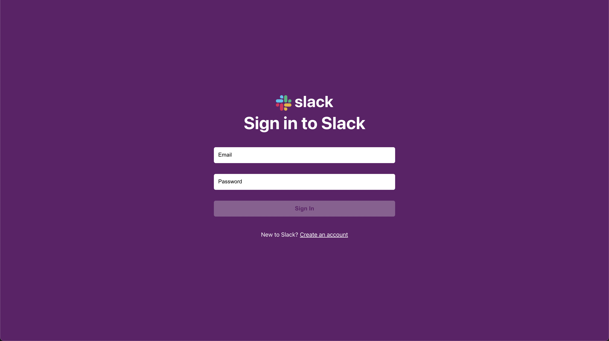
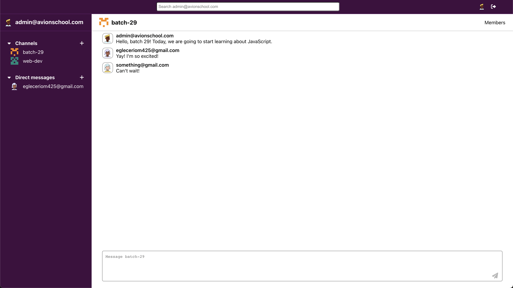
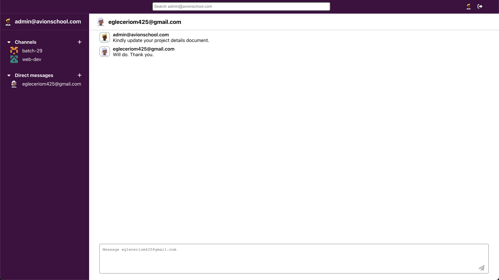
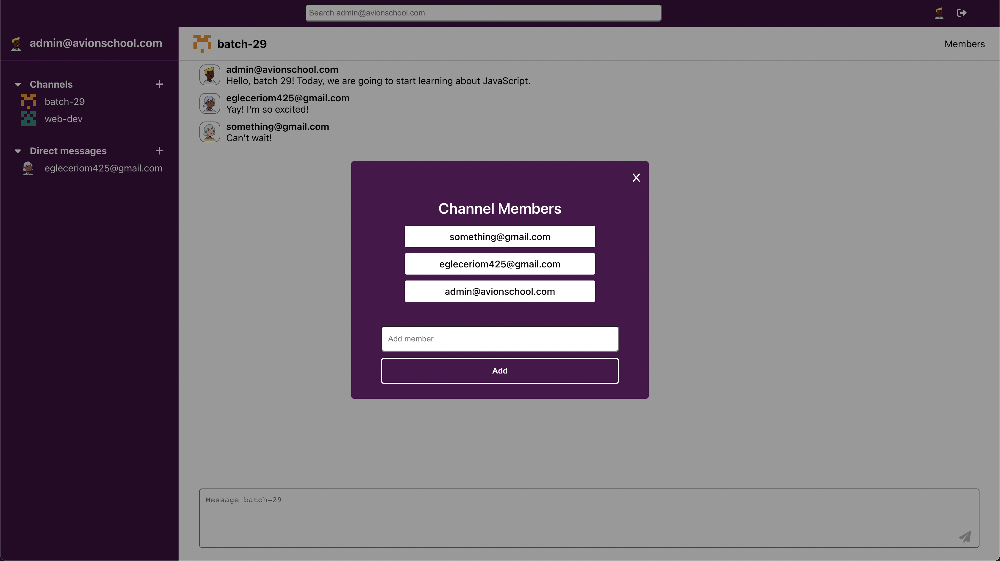
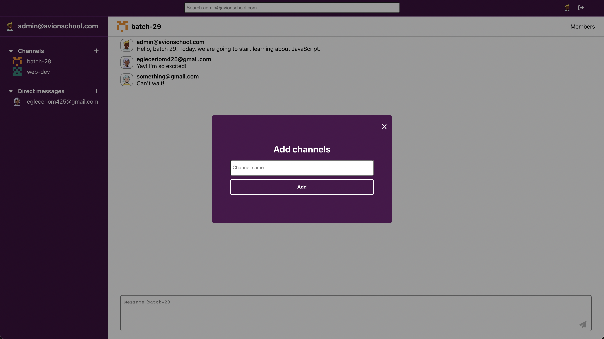

### ✨ [Slack App (Click to see live version)](https://avi-slack-app.vercel.app/)

>> ###### *A  ReactJS application that allows users to send messages to other users directly or through a channel.*
>> - Applied real-time direct message and channel message by setting an interval for an API call to retrieve messages.
>> - Utilized API endpoints to implement a function so users can create a channel and add members to the channel.
>> - Implemented dynamic single-page application routing by using react router.
>> - Used local storage to retain data integrity on accidental refresh of the page.
>> - Created API helpers for easier server communication using Axios.

 

>> ###### Sources:
>> - ReactJS [Documentation](https://reactjs.org/docs/getting-started.html)
>> - Slack App [API Documentation](https://docs.philacctguide.xyz/)
>> - Slack App [API Documentation (Github)](https://gist.github.com/maurusrv/990fd96beb30272cbfd411ace222f355)
>> - [DiceBear Avatar Library](https://avatars.dicebear.com/)
